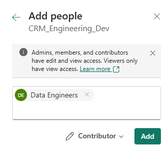
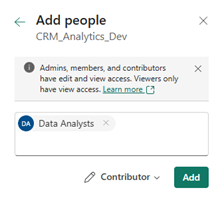

# 📊 CRM Analytics with Microsoft Fabric

This project simulates a modern CRM Analytics solution using the Microsoft Fabric platform. It involves generating synthetic data as well as integrating real-world data from a public API, storing it in a Lakehouse using the Medallion architecture, processing and transforming it with PySpark, leveraging Delta Lake versioning, automating pipelines, and building interactive dashboards with Power BI.

---

## 🚀 Technologies Used

- [Microsoft Fabric](https://www.microsoft.com/en-us/microsoft-fabric)
- Lakehouse (Delta Lake)
- Power BI
- PySpark (via Fabric notebooks)
- Fabric Pipelines
- Python (with Faker and requests)
- SQL (DAX, Spark SQL)

---

# ⚙️ Project Structure and Environment Strategy

To ensure scalability, maintainability, and adherence to security and CI/CD best practices, this project is organized into two primary environments, each aligned with a specific team responsibility:

- `CRM Engineering`: Responsible for ingestion and transformation (Bronze & Silver layers)
- `CRM Analytics`: Focused on curated data, semantic modeling, and business reporting (Gold layer)

Each environment is structured into **three isolated workspaces** — Development (`Dev`), Staging (`Staging`), and Production (`Prod`) — to enable safe delivery workflows and strict access control.

---

## 🛠️ Environment Breakdown

| Workspace Name                                                                 | Purpose                                                                 | Git Branch               | Folder Path                        |
|--------------------------------------------------------------------------------|-------------------------------------------------------------------------|---------------------------|-------------------------------------|
| [`CRM_Engineering_Dev`](./images/infra/workspace-crm-engineering-dev.png)     | Development of pipelines, notebooks, and ETL logic for Bronze/Silver.   | `crm_engineering_dev`     | `/workspaces/crm_engineering_dev`  |
| [`CRM_Engineering_Staging`](./images/infra/workspace-crm-engineering-staging.png) | Testing and validation of stable pipelines before production release.   | `crm_engineering_staging` | `/workspaces/crm_engineering_staging` |
| [`CRM_Engineering_Prod`](./images/infra/workspace-crm-engineering-prod.png)   | Production-grade ingestion and transformation with monitoring enabled.  | `crm_engineering_prod`    | `/workspaces/crm_engineering_prod` |
| [`CRM_Analytics_Dev`](./images/infra/workspace-crm-analytics-dev.png)         | Development of semantic models and Power BI dashboards (Gold layer).    | `crm_analytics_dev`       | `/workspaces/crm_analytics_dev`    |
| [`CRM_Analytics_Staging`](./images/infra/workspace-crm-analytics-staging.png) | QA and stakeholder review of reports and models before publication.     | `crm_analytics_staging`   | `/workspaces/crm_analytics_staging`|
| [`CRM_Analytics_Prod`](./images/infra/workspace-crm-analytics-prod.png)       | Live environment for business reporting and analytics delivery.         | `crm_analytics_prod`      | `/workspaces/crm_analytics_prod`   |

---

## 🔐 Why This Structure?

This multi-workspace strategy aligns with enterprise best practices in **data platform governance**:

- ✅ **Security by Design**: Access is isolated by role and stage. Engineers have full access to Bronze/Silver; analysts only to Gold (read-only in production).
- ✅ **Separation of Concerns**: Engineering and analytics teams operate in isolated environments to avoid conflict and ensure autonomy.
- ✅ **CI/CD Readiness**: Each workspace is linked to a dedicated Git branch, enabling automated deployment pipelines per stage (e.g., `Dev`, `Staging`, `Prod`).
- ✅ **Safe Experimentation**: Development environments allow rapid prototyping without affecting production data or dashboards.
- ✅ **Audit & Compliance**: Production workspaces are monitored, versioned, and subject to strict controls for traceability.

---

📁 Workspace and access configuration images are stored in:
- [`/images/infra`](./images/infra) – Workspace setup and Git integration
- [`/images/security`](./images/security) – Role-based access control and group definitions

---

## 🔐 Security and Access Management

This project adopts **RBAC (Role-Based Access Control)** and the **Principle of Least Privilege (PoLP)** to manage access and responsibilities across environments, ensuring secure and traceable collaboration across the data lifecycle.

### 👥 1. Azure Entra Users

Two simulated enterprise users were created:

- [`dataEngineer@yourdomain.com`](./images/security/user-data-engineer.png)
- [`dataAnalyst@yourdomain.com`](./images/security/user-data-analyst.png)

---

### 👥 2. Azure Entra Security Groups

Security groups were created to simplify access management across workspaces:

- [`Data Engineers`](./images/security/group-data-engineers.png): Team responsible for data ingestion, transformation, and Lakehouse management.
- [`Data Analysts`](./images/security/group-data-analysts.png): Team focused on analytics, semantic modeling, and dashboard development.

---

### 🏢 3. Workspace Role Assignments

Access roles were assigned according to each team's responsibility within their environments:

#### 🧱 **Engineering Workspaces** (`Bronze` & `Silver` Layers)

| Workspace | Assigned Group     | Role        | Screenshot |
|-----------|--------------------|-------------|------------|
| [`CRM_Engineering_Dev`](./images/infra/workspace-crm-engineering-dev.png)     | Data Engineers | Contributor |  |
| [`CRM_Engineering_Staging`](./images/infra/workspace-crm-engineering-staging.png) | Data Engineers | Contributor | _same pattern_ |
| [`CRM_Engineering_Prod`](./images/infra/workspace-crm-engineering-prod.png)   | Data Engineers | Viewer (optional) | _optional read-only for audits_ |

#### 📊 **Analytics Workspaces** (`Gold` Layer)

| Workspace | Assigned Group   | Role        | Screenshot |
|-----------|------------------|-------------|------------|
| [`CRM_Analytics_Dev`](./images/infra/workspace-crm-analytics-dev.png)       | Data Analysts | Contributor |  |
| [`CRM_Analytics_Staging`](./images/infra/workspace-crm-analytics-staging.png) | Data Analysts | Contributor | _same pattern_ |
| [`CRM_Analytics_Prod`](./images/infra/workspace-crm-analytics-prod.png)     | Data Analysts | Viewer      | _read-only for published reports_ |

---

### ✅ Security Best Practices Followed

- **Least Privilege Enforcement**: Each group has only the access level needed to perform its function in a specific environment.
- **Environment Isolation**: Dev, Staging, and Prod workspaces ensure controlled and testable deployment flows.
- **Separation of Duties**: Engineers work exclusively on ingestion/transformation; analysts work on reporting.
- **Centralized Identity & Access Control**: Managed via Azure Entra ID, enabling scalable enterprise governance.
- **Auditable Workspaces**: Production access is read-only for analysts and optionally restricted for engineers.

📁 Security-related diagrams and screenshots are stored in:  
[`/images/security`](./images/security)

---

## 🏛️ Medallion Architecture

This project follows the Medallion data architecture pattern:

### 🥉 Bronze – Raw Layer
> Storage of raw data (synthetic and real), without transformations.

| Table               | Source                      | Description                             |
|----------------------|----------------------------|----------------------------------------|
| `bronze_customer`    | Faker                      | Synthetic customer records                     |
| `bronze_products`    | Faker                      | Products with categories and pricing       |
| `bronze_sales`      | Faker                      | Simulated sales history         |
| `bronze_ibge_states`| API IBGE                   | Official list of Brazilian states           |

---

### 🥈 Silver – Clean Layer
> Cleaned data with standardized schemas, adjusted data types, and applied joins.

| Table               | Description                          |
|----------------------|------------------------------------|
| `dim_customer`        | Customer dimension               |
| `dim_product`        | Product dimension               |
| `dim_time`          | Time dimension (2 years range)         |
| `dim_geographic`       | Standardized geographic dimension    |
| `fact_sales`        | 	Fact table with keys and metrics         |

---

### 🥇 Gold – Business Layer
> Final business-ready data for aggregations and key indicators.

| Table                   | Description                           |
|--------------------------|-------------------------------------|
| `total_sales_state`   | Total sales by state          |
| `top_customers`        | Top customers by volume      |
| `top_products`           | Best-selling products              |

---

## 🔐 Security

- **Workspace-level access control** in Microsoft Fabric
- **Data masking for sensitive fields**, such as customer emails
- **Layer-based access separation**: full access to Bronze/Silver, read-only access to Gold
- Ready for **auditing and monitoring** via Fabric or Azure Purview

---

## 🕒 Data Versioning with Delta Time Travel

This project uses Delta Lake as the storage format, allowing automatic versioning of all tables. This enables:

- Restore previous versions of any table
- Audit transformations and load history
- Re-run analyses based on historical versions

Example usage in a notebook:

```sql
-- Query a previous version of the sales fact table (SQL)
SELECT * FROM silver.fato_vendas VERSION AS OF 3
```
```python
# Query a previous version using PySpark
df_v2 = spark.read.format("delta") \
    .option("versionAsOf", 3) \
    .load("Tables/silver/fact_sales")
```

## ⚙️ Pipeline Automation

All ETL processes are automated using Microsoft Fabric Pipelines.

🔁 Created Pipelines

| Pipeline                   | Steps Description                           |
|--------------------------|-------------------------------------|
| `etl_bronze_to_silver`   | Cleaning, casting, joins, write to Silver          |
| `etl_silver_to_gold`     | Aggregations and final indicators generation      |
| `api_collection_ibge`           | Real-time data collection from IBGE API              |

Each pipeline can be scheduled (e.g., daily) or triggered manually.

---

## 📊 Power BI Dashboards

- 🗺️ Sales map by state (map and bar chart)
- 📦 Top-selling products
- 👥 Most active customers
- 📉 Sales trend over time (line chart)

> Dashboards were built directly within Power BI in Fabric, using native Lakehouse connections.

📷 Dashboard screenshots are available in /imagens/dashboard.png.

---

## ⚡ Performance Best Practices

- Storage in Delta Lake (compression + versioning)
- Table partitioning in Silver and Gold layers (e.g., by state or date)
- Reusable notebook modules
- Clear separation of responsibilities across layers
- Incremental ETL with future timestamp control (optional)

---

## 📁 Project Structure

```plaintext
crm-analytics-fabric/
├── notebooks/
│   ├── geracao_dados.ipynb
│   ├── coleta_api_ibge.ipynb
│   ├── bronze_to_silver.ipynb
│   └── silver_to_gold.ipynb
├── pipelines/
│   ├── etl_bronze_to_silver.json
│   ├── etl_silver_to_gold.json
│   └── api_coleta_ibge.json
├── modelagem/
│   └── modelo_dimensional.drawio
├── imagens/
│   └── dashboard.png
├── README.md
```
---

## 🧠 Demonstrated Skills

- ✔️ Dimensional modeling (star schema)
- ✔️ Lakehouse architecture
- ✔️ Medallion architecture (Bronze → Silver → Gold)
- ✔️ ETL with PySpark
- ✔️ Delta Time Travel (data versioning)
- ✔️ Automation with Fabric Pipelines
- ✔️ Data visualization with Power BI
- ✔️ Security and performance best practices

---

**Author:** Danillo Oliveira  
**LinkedIn:** https://www.linkedin.com/in/danillobsoliveira/ 
